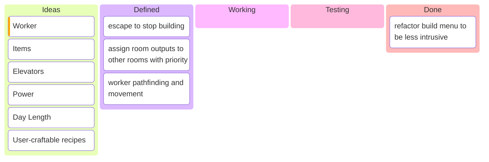
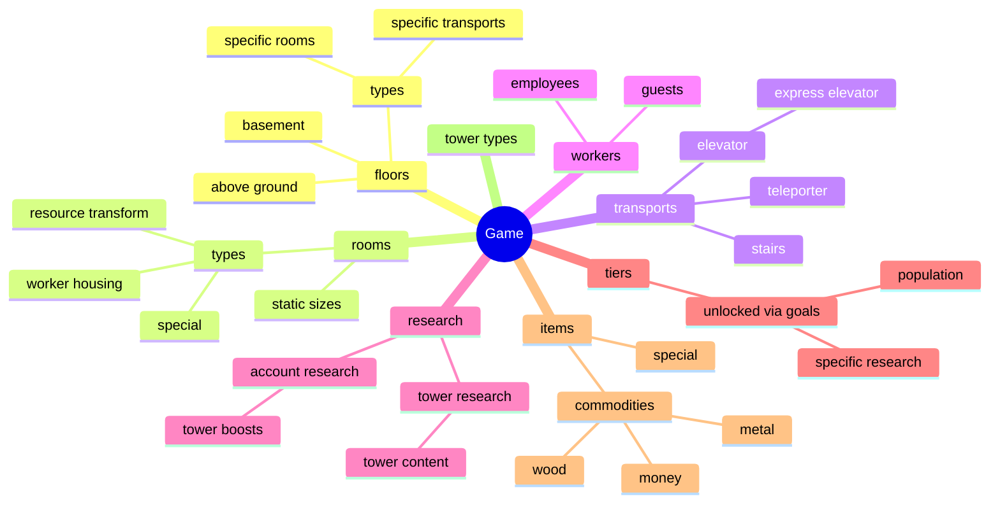

# Kanban

```mermaid

kanban
    idea[Ideas]
        [Worker]@{priority: 'High'}
        [Items]
        [Elevators]
        [Power]
        [Day Length]
        [User-craftable recipes]
    defined[Defined]
        [escape to stop building]
        [assign room outputs to other rooms with priority]
        [worker pathfinding and movement]
    wip[Working]
    test[Testing]
    done[Done]
        [refactor build menu to be less intrusive]

```

# Ideas map

```mermaid

mindmap
game((Game))
    floors
        above ground
        basement
        types
            specific rooms
            specific transports
    rooms
        static sizes
        types
            worker housing
            resource transform
            special
    transports
        stairs
        elevator
            express elevator
        teleporter
    workers
        employees
        guests
    research
        tower research
            tower content
        account research
            tower boosts
    tiers
        unlocked via goals
            population
            specific research
    items
        commodities
            money
            wood
            metal
        special
            
    tower types
        
```