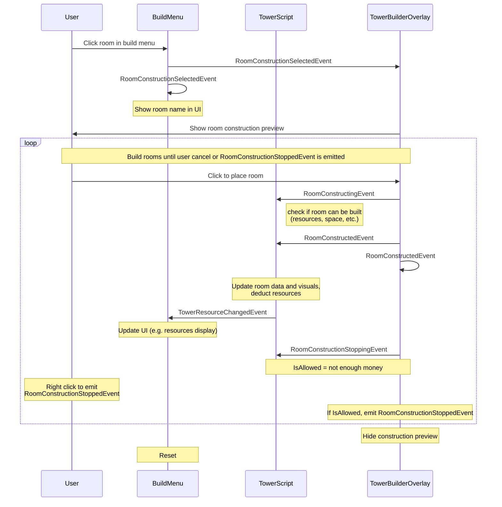

## Building a room
Can also be applied to other construction types. Just replace "Room" with "Floor" or "Transport"

```mermaid
sequenceDiagram
    participant u as User
    participant b as BuildMenu
    participant t as TowerScript
    participant tt as TowerBuilderOverlay
    u->>b: Click room in build menu
    b->>tt: RoomConstructionSelectedEvent
    b->>b: RoomConstructionSelectedEvent
    Note over b: Show room name in UI
    tt->>u: Show room construction preview
    loop 
        Note over u,tt: Build rooms until user cancel or RoomConstructionStoppedEvent is emitted
        u->>tt: Click to place room
        tt->>t: RoomConstructingEvent
        Note right of t: check if room can be built<br>(resources, space, etc.)
        tt->>t: RoomConstructedEvent
        tt->>tt: RoomConstructedEvent
        Note over t: Update room data and visuals,<br> deduct resources
        t->>b: TowerResourceChangedEvent
        Note over b: Update UI (e.g. resources display)
        tt->>t: RoomConstructionStoppingEvent
        Note over t,tt: IsAllowed = not enough money
        Note over u: Right click to emit<br>RoomConstructionStoppedEvent
        Note over tt: If IsAllowed, emit RoomConstructionStoppedEvent
    end
    Note over tt: Hide construction preview
    Note over b: Reset
```