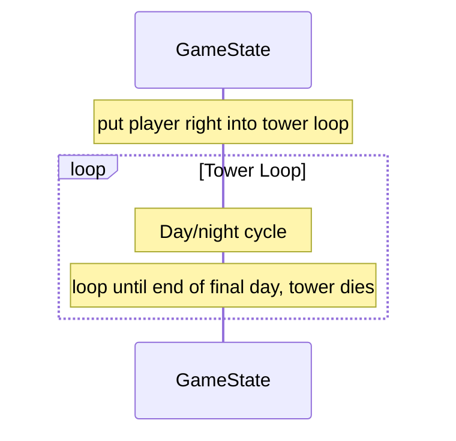

# Overall game loop

```mermaid

sequenceDiagram
	participant u as GameState

	Note over u: put player right into tower loop

	loop Tower Loop
		note over u: Day/night cycle
		note over u: loop until end of final day, tower dies
	end


```