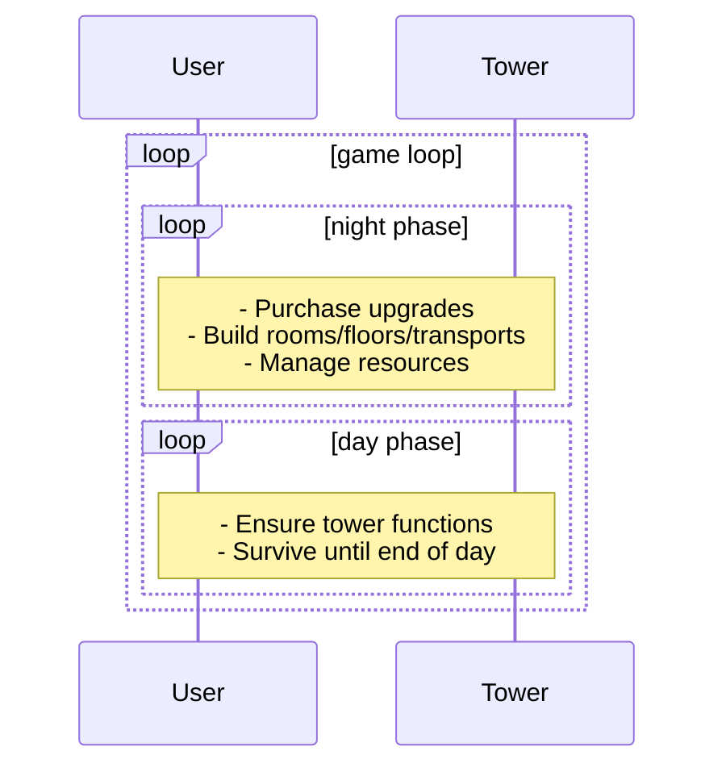

# Day/Night cycle - overall game loop
The game consists of a day phase, where the tower is active and the player interacts with the mechanics of the tower.
This phase only lasts for a certain amount of time, after which it transitions to the night phase.

During the night phase, the tower is inactive and the player can only interact with the UI (e.g. to build new rooms or manage resources). 
The night phase lasts forever until the player chooses to advance to the next day.

This cycle resembles a typical tower-defense-like game loop, where after each round (the day phase) the game is essentially paused (the night phase) and the player can prepare for the next day.

